# 📺 Netflix 고객 이탈 예측 프로젝트

## 📌 프로젝트 개요

본 프로젝트는 Netflix 사용자 로그 및 메타 데이터를 활용하여 **고객 이탈(Churn) 예측 모델**을 구축하는 것을 목표로 합니다.  

---

## 📂 1. 사용 데이터

### 데이터 수집 및 DB 적재
- **수집 환경**: 도커 컨테이너(Docker Container) 상에서 Kaggle 데이터셋을 다운로드하였습니다.
- **수집 전처리**: 원본 데이터에서 중복 값을 제거하고, 문자열로 된 ID 데이터(예: `user_0001`)를 정수형(`1`)으로 일괄 변환하여 DB에 적재했습니다.

### 원본 데이터 구성
프로젝트에 사용된 원본 데이터는 총 6개의 테이블로 구성됩니다.

| 테이블명 | 주요 정보 |
|---|---|
| `users` | 사용자 기본 정보 및 구독 정보 (이탈 여부 예측의 타겟 변수 포함) |
| `watch_history` | 콘텐츠 시청 로그 |
| `movies` | 콘텐츠 메타 데이터 |
| `recommendation_logs` | 시스템 추천 로그 |
| `search_logs` | 검색 로그 |
| `reviews` | 콘텐츠 리뷰 정보 |

**타겟 변수 (Target Variable)**
- `is_active` 값을 역으로 변환하여 `churned` (이탈 여부) 변수 생성 (유지: 0, 이탈: 1)
- 데이터 탐색 결과, 유지 고객이 약 8,500명인데 반해 이탈 고객은 약 1,500명에 불과하여 클래스 불균형이 존재하는 것으로 확인되었습니다.

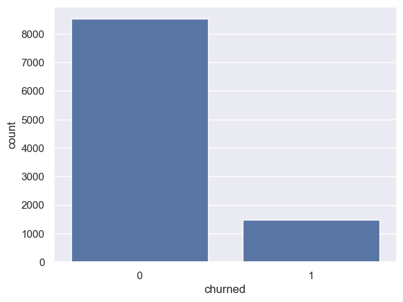

---

## 📊 2. EDA 주요 인사이트

- **Age (나이)**: 평균 및 중앙값은 35세. 음수(0세 미만) 및 비현실적으로 높은 데이터(100세 초과) 등 이상치가 존재하여 데이터 정제가 필요함을 확인하였습니다.
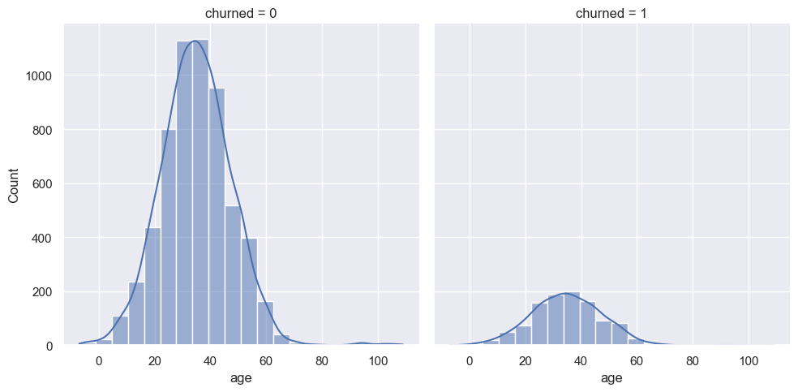
- **Gender (성별)**: 여성, 남성 비율이 비슷하며 응답 거부(Prefer not to say) 등의 값도 존재합니다. 차트를 통해 각 성별에 따른 이탈률의 큰 차이는 나지 않음을 확인했습니다.
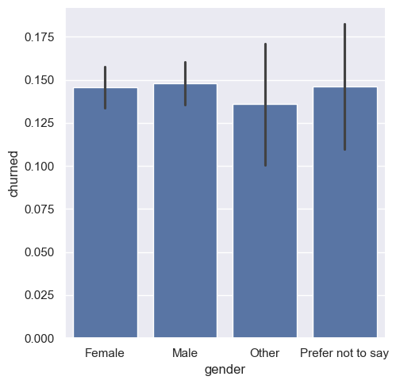
- **Monthly Spend**: 이름만으로는 월별 소비 금액인지, 시간인지 알 수 없었습니다. 분포를 확인했을때 우측으로 극단적으로 치우쳐져 있어, 선형성과 정규성 확보를 위해 로그 변환(Log Transformation)이 필수적인 것으로 분석되었습니다. 또한, 

  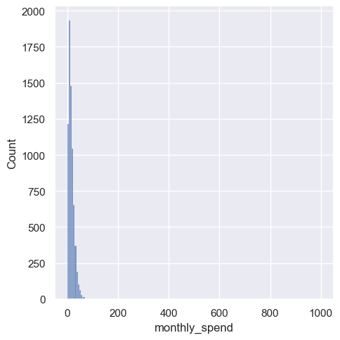
  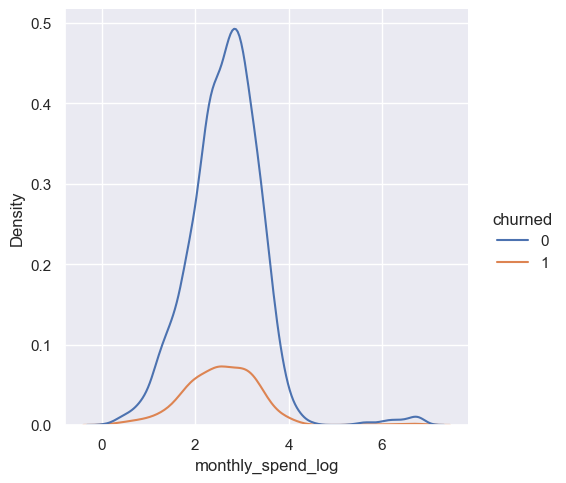

- **Country & Province (지역)**: 미국과 캐나다 지역으로 분포되어 있으며 30개 주(Province)에 걸쳐 주별 이탈률 미세 차이가 존재합니다.
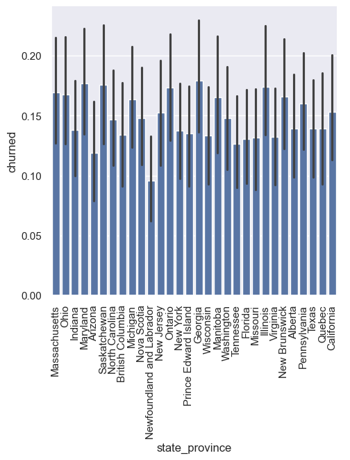
- **Subscription Plan (구독 플랜)**: Basic, Standard, Premium, Premium+ 총 4가지 형태의 플랜 데이터가 고루 존재합니다. 구독 플랜별로 monthly_spend의 분포를 확인했을 때, 플랜에 따른 차이가 크지 않은 것을 확인하면서 금액이 아닌 소비 시간으로 해석됩니다.
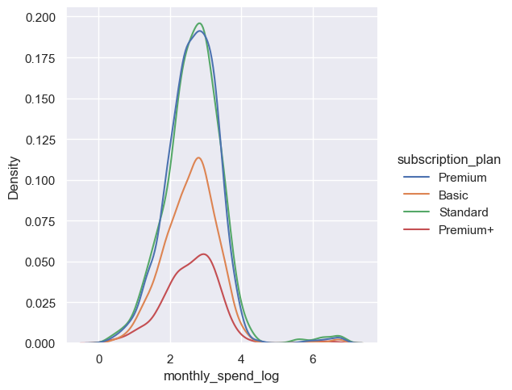
- **Device (사용 기기)**: Mobile, Desktop, Smart TV, Laptop, Tablet, Gaming Console 등 6가지 기기를 이용하고 있습니다.
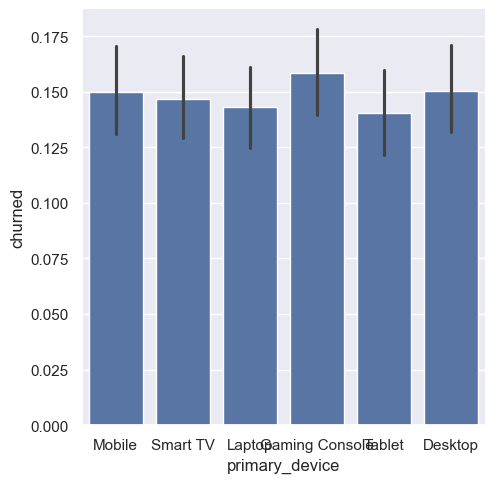
- **Household Size**: 2인 가구가 가장 많으며, 1인 가구, 3인 가구 순으로 분포되어 있습니다.
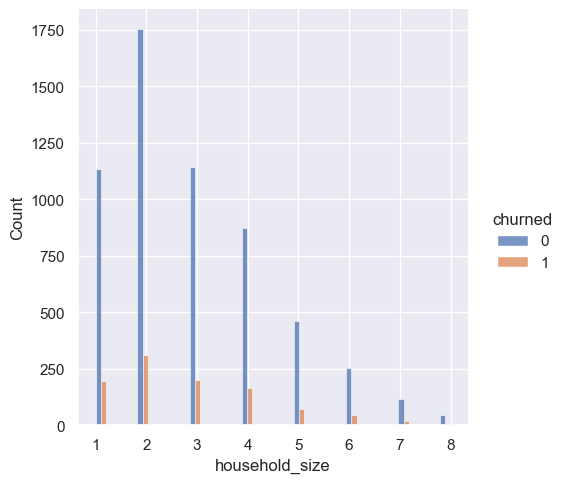

---

## 🔧 3. 피처 엔지니어링 (Feature Engineering)

기존 6개의 테이블을 결합하여, 유저의 활동성을 대변할 수 있는 다양한 파생 변수를 생성하고 전처리를 수행했습니다.

### 데이터 정제 및 결측치 처리
- **`age` 변수 이상치 제거**: `age` 변수에서 '평균 ± 2*표준편차' 범위를 벗어나는 이상치 데이터를 제거하였습니다.

  

    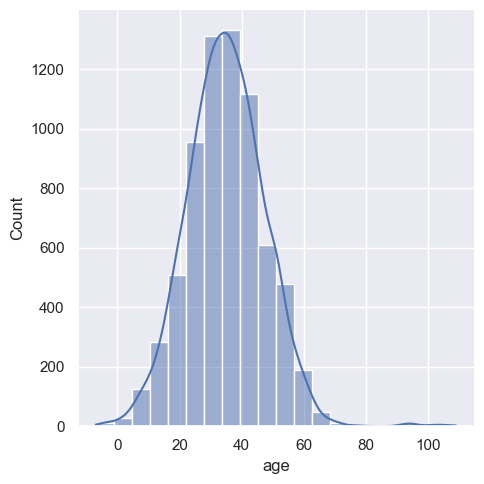
    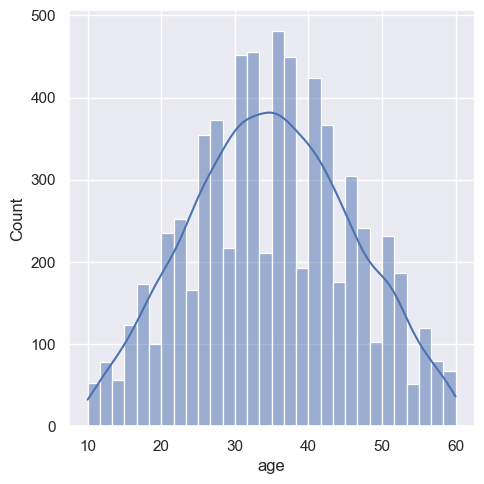
  

- **결측치 대치**: 
  - `monthly_spend`: 동일한 구독 플랜(`subscription_plan`)을 가진 유저들의 평균으로 결측치를 대치한 뒤, 로그 변환(`monthly_spend_log`)을 적용하였습니다.

  

    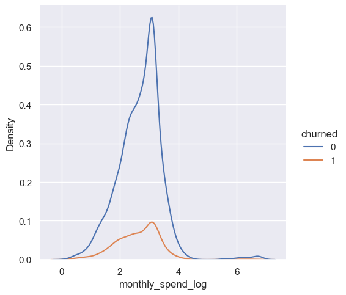
    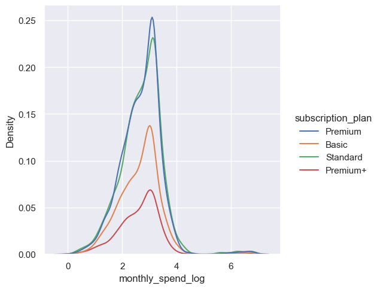
  

  - `household_size`: Null 값을 0으로 채우고, 이를 구분하기 위해 결측 여부를 나타내는 Flag 변수(`household_size_missing`)를 추가하였습니다.
  - `gender`: 'Male', 'Female' 외의 응답 값은 모두 'Other'로 통합하여 스파스(Sparse)한 범주를 단순화했습니다.

  
  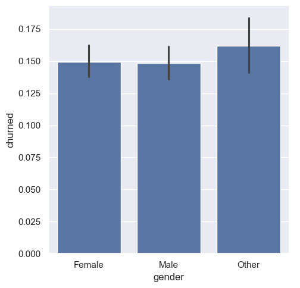

### 파생 변수 도출
- **추천 클릭률 (`recommendation_click_rate`)**: 추천받은 총 횟수 대비 실제 클릭으로 이어진 비율
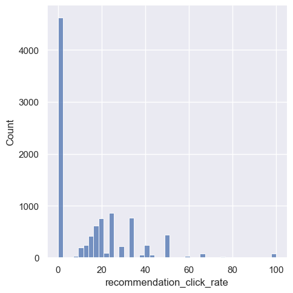
- **콘텐츠 상호작용 횟수 (`num_content_interaction`)**: 리뷰 작성 수, 추천 클릭 수, 검색 횟수를 모두 합산한 총 활동성 지표

  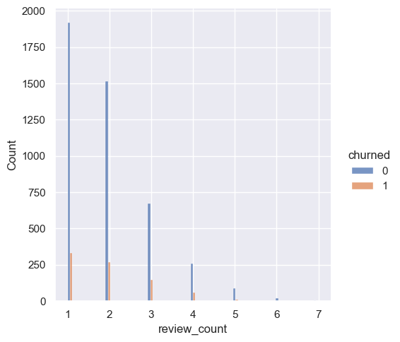
  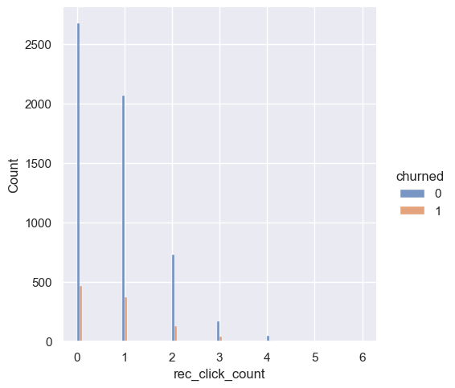

  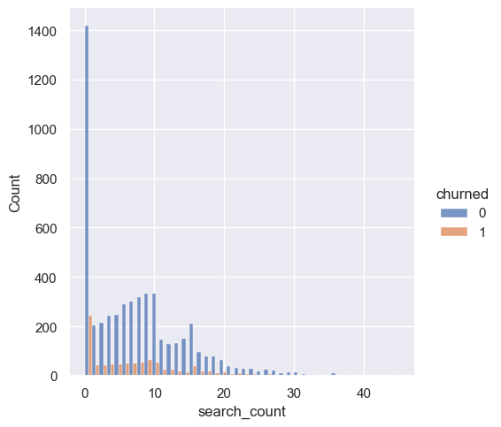
  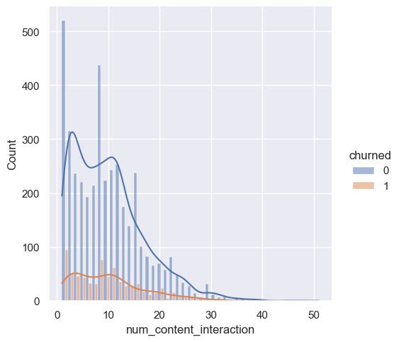

- **평균 부여 평점 (`mean_rating_given`)**: 사용자가 시청 대상에 남긴 리뷰 평점의 평균
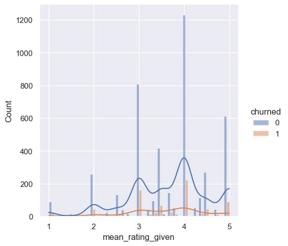
- **시청 완료율 (`completion_rate`)**: 재생한 시청 기록 중 'Completed' 처리되었거나 100% 진행도를 달성한 기록의 비율
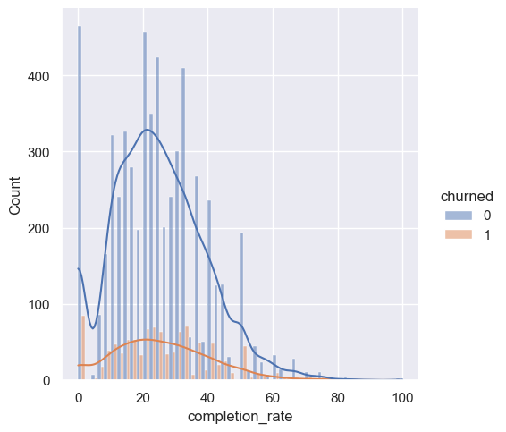
- **주간 평균 시청 횟수 (`watch_sessions_per_week`)**: 유저의 활동 주차별로 평균 몇 개의 시청 세션(Session)을 갖는지 측정
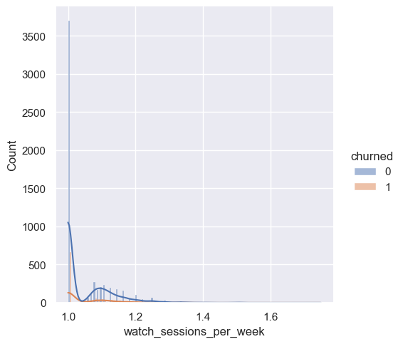
- **일평균 시청 시간 (`avg_watch_time_minutes`)**: 시청일자 별 합산 시청 시간을 구한 뒤 도출한 하루 평균 콘텐츠 이용 시간(분)
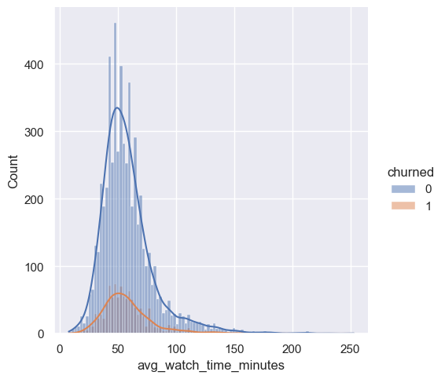
- **선호 장르 (`favorite_genre`)**: 유저의 시청 로그와 영화 테이블을 결합하여 가장 자주 시청한 장르를 추출
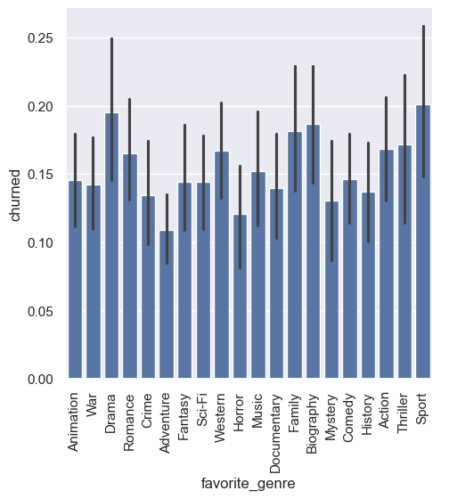
- **마지막 활동 일자 (`final_activity_date`)**: 시청, 검색, 리뷰 전체 로그 중 가장 마지막 일자를 구하여 최근 활동성 파악

### 형 변환 및 인코딩 (Encoding)
- 요금제 등급(`subscription_plan`) 등급에 따른 **순서형(Ordinal) 인코딩** 적용
- 모델이 처리하지 못하는 `subscription_start_date`, `final_activity_date`는 년/월/일/요일 특성으로 분해
- 나머지 범주형 변수(성별, 국가, 기기, 선호 장르)는 **원핫 인코딩(One-Hot Encoding)** 적용

---

## 🤖 4. 모델링 (Modeling)

- 데이터셋 준비 과정에서 의미 없는 식별 정보(이메일, 이름)를 제거하였고, 문자열이지만 unique value가 너무 많은 도시 정보도 모델에 특성이 잡히지 앉아 제거했습니다.

- 고객의 유지(0)와 이탈(1)을 예측하는 **이진 분류(Binary Classification)** 문제로, **혼동 행렬**과 **ROC-AUC**를 통해 모델 성능을 확인하였습니다.

### Model_V0
- 타겟 클래스 불균형 문제를 고려하지 않고 구축한 최초 **Baseline Model(V0)** 은 Decision Tree를 사용하였습니다.
- 초기에는 피처가 부족한 것으로 판단되어, 피처 엔지니어링을 통해 성능 향상을 도모했습니다.

  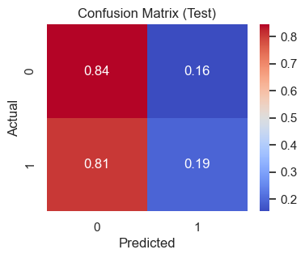
  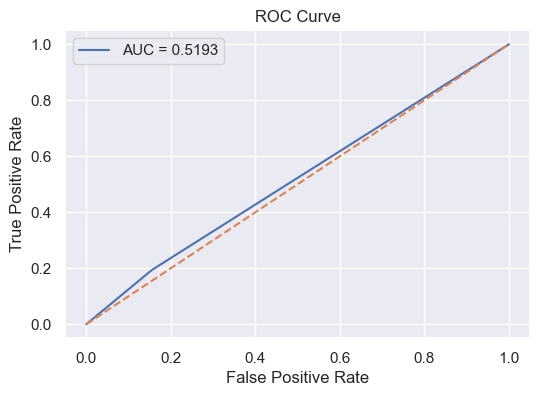

### Model_V1 (파생 변수 추가)
- 위 피처 엔지니어링 단계에서 도출한 다양한 파생 변수들을 결합하여 모델 성능 개선을 시도했습니다.
- 결측치가 존재하는 ['recommendation_click_rate', 'review_count', 'rec_click_count', 'search_count', 'num_content_interaction', 'mean_rating_given'] 변수들은 제외하였습니다.

  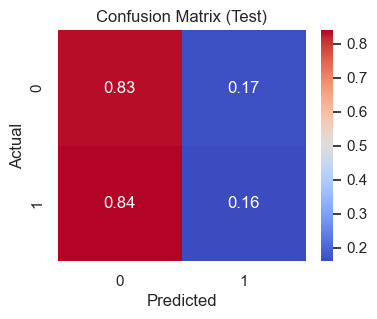
  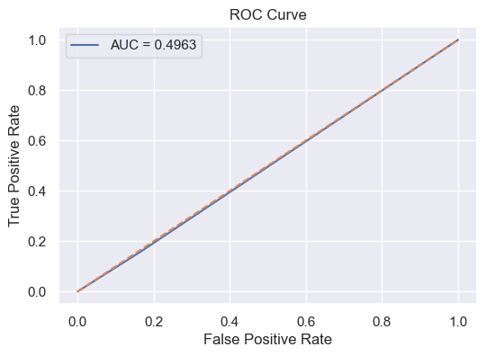

### Model_V2 (데이터 리샘플링)
- 데이터 레이블의 클래스 불균형 문제를 해소하기 위해 **언더 샘플링 (Random Under Sampling)**을 적용하였습니다. (`sampling_strategy='auto'`를 통해 5:5로 샘플링)

  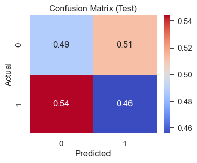
  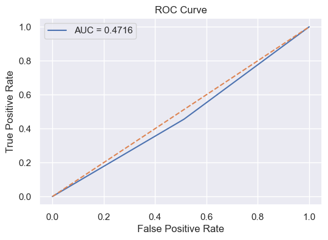

### 모델 성능 비교
트리기반의 머신러닝 모델 알고리즘들을 리샘플링 데이터셋과 결합하여 예측 성능을 비교 분석하였습니다.
- **Random Forest**
- **XGBoost Classifier**
- **LightGBM Classifier**

> **Random Forest**

  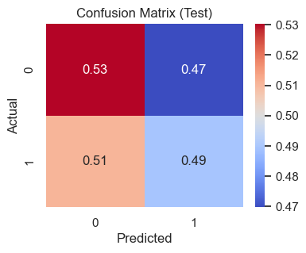
  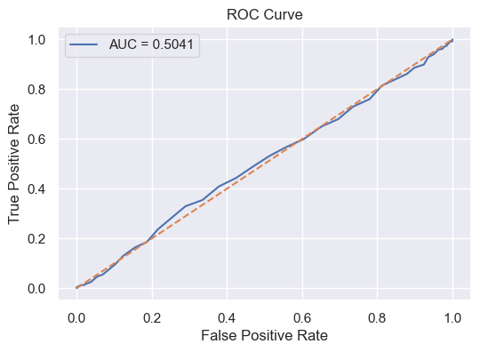

> **XGBoost Classifier**

 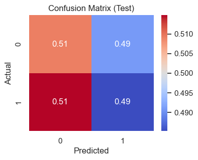
 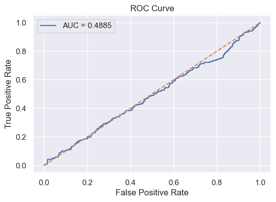

> **LightGBM Classifier**

 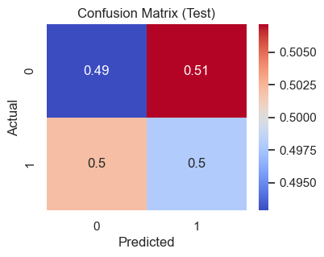
 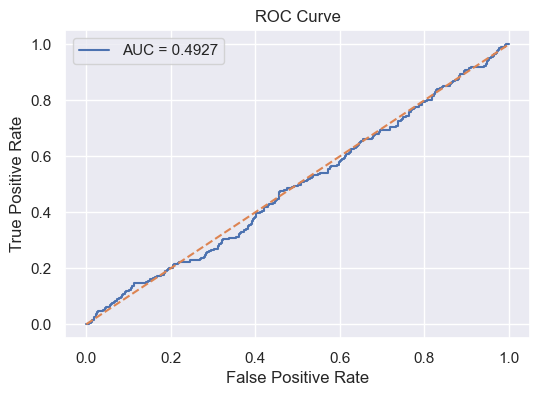

